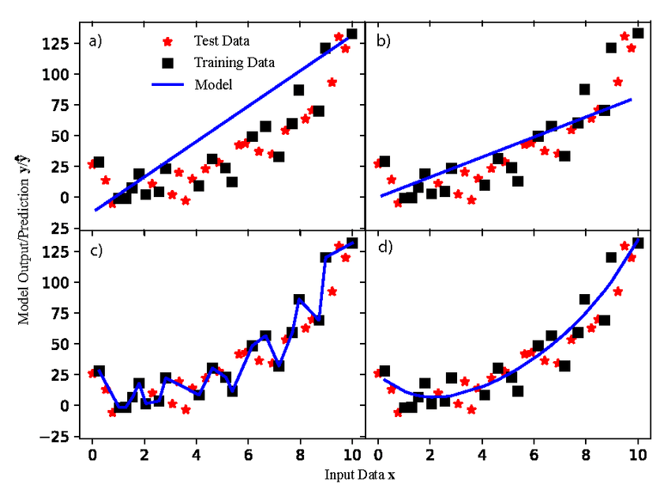
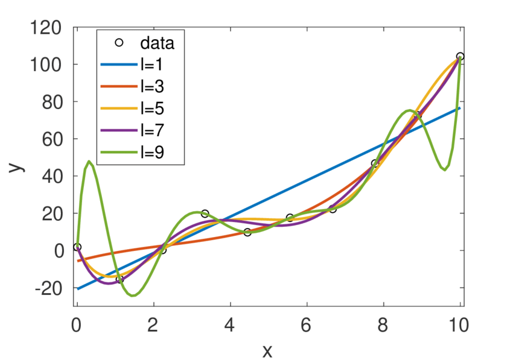

# 🎯 Underfitting vs Overfitting

Understanding this is **core ML + interview favorite question**.

---

# 📉 Underfitting

## 🔹 What is it?

Model is **too simple** to capture the pattern in data.

## 🔹 What happens?

* High training error
* High test error
* Poor performance everywhere

## 🔹 Why?

* Model too simple (e.g., linear model for nonlinear data)
* Too much regularization
* Not enough features
* Insufficient training

## 🔹 Graph Intuition

Straight line trying to fit curved data.

## 🔹 Bias–Variance

👉 **High Bias, Low Variance**

---

# 📈 Overfitting

## 🔹 What is it?

Model learns **noise + random fluctuations** instead of true pattern.

## 🔹 What happens?

* Very low training error
* High test error
* Poor generalization

## 🔹 Why?

* Model too complex (deep tree, high-degree polynomial)
* Too many features
* Small dataset
* No regularization

## 🔹 Graph Intuition

Curve wiggles to pass through every point.

## 🔹 Bias–Variance

👉 **Low Bias, High Variance**

---

# ⚖️ Comparison Table

| Feature          | Underfitting        | Overfitting                    |
| ---------------- | ------------------- | ------------------------------ |
| Model Complexity | Too Low             | Too High                       |
| Training Error   | High                | Very Low                       |
| Test Error       | High                | High                           |
| Bias             | High                | Low                            |
| Variance         | Low                 | High                           |
| Fix              | Increase complexity | Reduce complexity / Regularize |

---

# 🧠 Interview 30-Second Answer

“Underfitting occurs when a model is too simple and fails to capture the underlying pattern, leading to high training and test error. Overfitting occurs when a model is too complex and captures noise in the data, resulting in low training error but high test error.”

---

If you want next:

* 📊 Bias–Variance curve explanation
* 🎯 How Cross Validation detects overfitting
* 🐍 Python demo with train/test error plot
* 🚀 FAANG-style tricky follow-up questions
